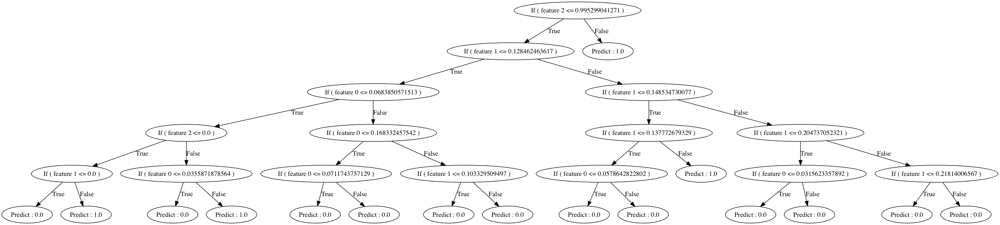

# Decision Tree Visualizer
[Decision tree](https://en.wikipedia.org/wiki/Decision_tree_learning) visualizer.

## Preface.
A small utility to convert text representation of SPARK decision trees into visual graph.

## Input format
The input format is in plain text. It can be obtained by using the
`toDebugString` method of [Spark's decision tree.](https://spark.apache.org/docs/latest/api/python/pyspark.ml.html#module-pyspark.ml.classification)

## Example
An input example may be found in the [input example directory](./input_example).

To activate the example use:
`python tree_visualize.py  --input_tree=parser/tree.txt --output_graph=out.dot`.
The output is a file in [dot](http://www.graphviz.org/) format, which can be then converted to many formats.
For example, the command below converts it to PDF:
`dot -Tpdf out.dot -oout.pdf`

